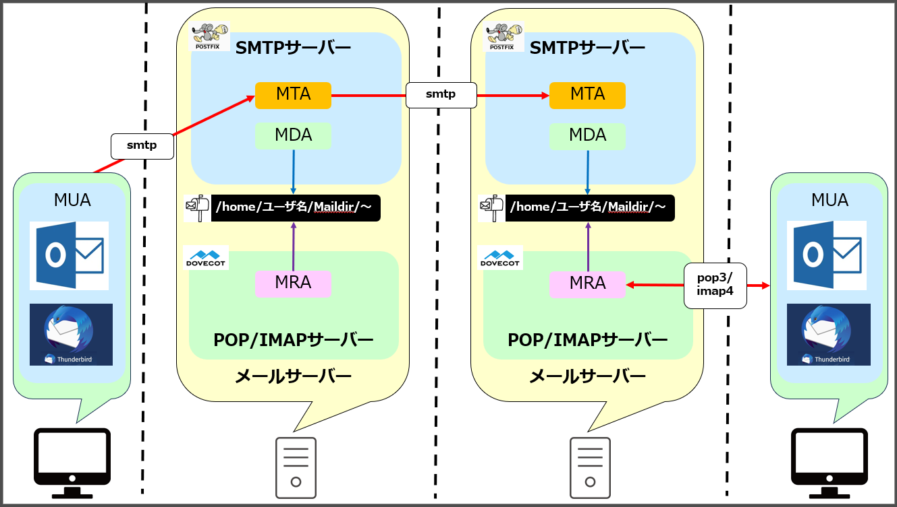

## 1.メールの基本  
まず混乱が無いように、メールの送受信を行うに当たり、`構成すべきもの`とメールのやり取りを行う`通信プロトコル`とを棲み分けて理解した方が分かり易いと思料。  
  
## 2.構成すべきもの
まずは一覧としては以下の通り。
- MUA
- SMTPサーバー
- POP/IMAPサーバー  

### 2-1.MUA
- エンドユーザがメールを送受信するときに使うメールソフト、いわゆるメーラーのこと
- 有名どころは`Outlook`、`thunderbird`など
- Mail User Agentの略
  
### 2-2.SMTPサーバー
- メールの転送を行うサーバー
- 主に`MTA`と`MDA`の２つの機能を持つ
- SMTPという通信プロトコルを使う
- 有名なソフトウェアとして、`Postfix`や`Sendmail`などがある  
  
#### MTA
- 実際にメールの転送する機能と、MUAや他のMTAからメールを受信する機能を持つ  
- MTA自体を`Postfix`や`Sendmail`などサービス名でいうこともある。つまり「MTAは何ですか？」という質問に対し、「Postfix」ですと答えることがある。
- Message Transfer Agent：メール転送エージェントの略  
  
#### MDA
- MTAに転送されてきたメールをメールボックスに配送する機能
- SMTPサーバーは、`mbox形式`と`Maildir形式`という形式でメールを保管するが、その保管場所にメールを配送するのがMDAの機能。また保管場所のことをいわゆる`メールボックス`という
- mbox形式の保管先：`/var/mail/ユーザ名/～`、あるいは`/var/spool/mail/ユーザ名/～（CentOS/Redhad）`
- Maildir形式の保管先：`/home/ユーザ名/Maildir/～`
- Mail Delivery Agent：メール配送エージェントの略
  
### 2-3.POP/IMAPサーバー
- メールを`MUA`に転送するサーバー
- 主に`MRA`という機能を持つ
- `POP3`や`IMAP4`といった通信プロトコルを使う
- 有名なソフトウェアとして、`Dovecot`などがある  
  
#### MRA
- メールボックスに保管されているメールをMUAに転送する機能をもつ
- MRAはPOP/IMAPサーバーの機能そのものなので、`MRAに「Dovecot」を使ってます`という文脈が成り立つ
- Mail Retrival Agent（メールレトリーバルエージェント）：メール検索エージェントの略
  
## 3.通信プロトコル
#### smtp
- SMTPサーバーとの通信に用いられるプロトコル
- `25番ポート`を使用
- メールの転送をする際に用いるプロトコル
- MUAからMTA及びMATからMATの通信の際に用いられる。  
  
#### pop3/imap4
- pop/imapサーバーとの通信に用いられるプロトコル
- pop3：`110番ポート`、imap4：`143番ポート`を使用
- メールボックスにあるメールをMUAへ送る際に用いられるプロトコル  
  

